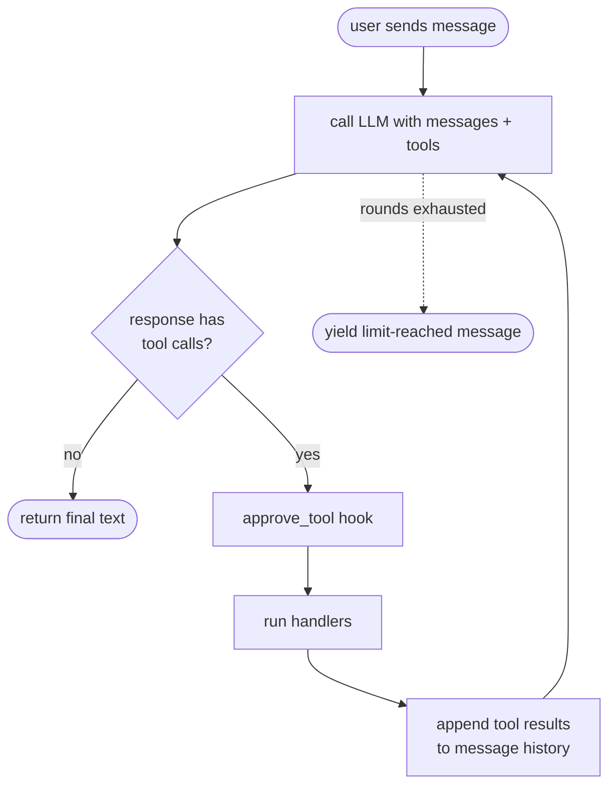

# Agents

`AgentSession` is the agentic loop built on top of the unified chat interface. Given a client, a system prompt, and zero or more tools, it repeatedly calls the LLM, dispatches any tool calls the model requests, feeds the results back, and keeps going until the model produces a plain text answer (or a round limit is hit).

## The loop



Each iteration of the loop is called a **round**. Tool lists are re-read at the top of every round, so MCP servers that emit `notifications/tools/list_changed` (and refresh `McpStreamable.tools` / `McpStdio.tools` in place) get picked up without restarting the session.

## Quick start

```python
from padwan_llm import AgentSession, LLMClient, McpStdio

async with AgentSession(
    client=LLMClient(model="gpt-4o"),
    mcp_tools=[McpStdio(command="uvx", args=["weather-mcp"])],
    system="You are a weather assistant.",
) as session:
    text = await session.send("What's the weather in Paris?")
    print(text)
```

Two entry points, depending on whether you want the response streamed:

- `await session.send(user_input)` — returns the complete text as a string.
- `async for chunk in session.stream(user_input)` — yields text chunks as the model produces them. Tool calls are silent on the stream; observe them via `on_tool`.

## Tools: individual or whole transports

`mcp_tools` accepts a heterogeneous list of `McpTool` and `McpTransport` (i.e. `McpStreamable` / `McpStdio`) instances. This is the main ergonomic win over managing transports by hand:

```python
from padwan_llm import AgentSession, LLMClient, McpStdio, McpStreamable, McpTool

weather_tool = McpTool(
    name="get_weather",
    description="Return current weather for a city.",
    input_schema={"type": "object", "properties": {"city": {"type": "string"}}},
    handler=lambda args: {"city": args["city"], "temp": 22, "sky": "sunny"},
)

async with AgentSession(
    client=LLMClient(model="gpt-4o"),
    mcp_tools=[
        weather_tool,                                                       # local definition
        McpStdio(command="uvx", args=["filesystem-mcp", "/home/me/docs"]),  # subprocess
        McpStreamable(url="https://tools.example.com/mcp", token="sk-..."), # remote
    ],
) as session:
    text = await session.send("Summarize the README and check the forecast.")
```

On `__aenter__` the session enters every transport in order (via an `AsyncExitStack`), pings each one to prove the connection is live, and then fires the optional `on_mcp_connect` callback with the transport instance. All transports are torn down in LIFO order on exit — even if one of them fails to initialize or ping.

## Configuration

```python
AgentSession(
    client=...,                    # LLMClientBase (e.g. LLMClient(model=...))
    system=None,                   # system prompt, stored in ConversationState
    mcp_tools=[],                  # McpTool | McpTransport instances
    max_tool_rounds=5,             # round cap; None = unbounded (use with care)
    max_tool_result_chars=8_000,   # truncate tool results sent to the LLM; None = no limit
    execution="sequential",        # "sequential" or "parallel"
    on_tool=None,                  # callback fired per tool call: (name, args) -> None
    on_tool_error=None,            # custom error formatter — see below
    approve_tool=None,             # pre-execution hook returning bool | Awaitable[bool]
    on_mcp_connect=None,           # fired per MCP transport after entering + pinging
    session_id=...,                # auto-generated; override to resume a saved session
    store=None,                    # optional ConversationStore for persistence
)
```

### Parallel tool execution

When a single LLM response contains multiple tool calls, `execution="parallel"` dispatches them via `asyncio.gather`. Results are still appended to the message history in original call order:

```python
session = AgentSession(
    client=LLMClient(model="gpt-4o"),
    mcp_tools=[...],
    execution="parallel",
)
```

Use the default `"sequential"` if you care about ordering side effects or want to rate-limit the downstream servers.

### Approval hooks

`approve_tool` runs before every tool dispatch. Return `False` to block the call — the agent will append a synthetic "denied by user" result instead of executing the handler. The hook may be sync or async:

```python
def prompt_user(tool, args):
    return input(f"Run {tool.name}({args})? [y/N] ").lower() == "y"

session = AgentSession(
    client=LLMClient(model="gpt-4o"),
    mcp_tools=[...],
    approve_tool=prompt_user,
)
```

### Error handling

By default, exceptions raised inside a tool handler are caught, formatted via a default string, and appended as the tool result so the model can recover. Override `on_tool_error` to customize:

```python
def format_error(tool, args, exc):
    return f"[{tool.name} failed: {type(exc).__name__}: {exc}]"

session = AgentSession(
    client=...,
    mcp_tools=[...],
    on_tool_error=format_error,
)
```

### Observation

`on_tool` receives a `ToolCallContext(name, args)` and must return a context manager wrapped around each tool dispatch. Use it for logging, UI updates, metrics, or span/timer scopes that need to bracket the call:

```python
from contextlib import contextmanager

@contextmanager
def log_call(tc):
    print(f"→ {tc.name}({tc.args})")
    yield
    print(f"← {tc.name} done")

session = AgentSession(..., on_tool=log_call)
```

For a fire-and-forget side-effect, `yield` immediately after the action.

## Persistence

Conversation state can be saved to any backend via the `ConversationStore` protocol:

```python
from padwan_llm import ConversationSnapshot, ConversationStore

class JsonStore:
    def __init__(self, path): self.path = path
    def save(self, session_id: str, snapshot: ConversationSnapshot) -> None:
        (self.path / f"{session_id}.json").write_text(json.dumps(snapshot))
    def load(self, session_id: str) -> ConversationSnapshot:
        return json.loads((self.path / f"{session_id}.json").read_text())
```

Persist after a turn completes:

```python
async with AgentSession(
    client=LLMClient(model="gpt-4o"),
    store=JsonStore(Path("./sessions")),
    session_id="user-42",
    system="...",
) as session:
    await session.send("Hi!")
    session.save()
```

Resume in a later process with the classmethod constructor:

```python
async with AgentSession.load(
    model="gpt-4o",
    store=JsonStore(Path("./sessions")),
    session_id="user-42",
) as session:
    await session.send("What were we talking about?")
```

`load()` pulls the `system` prompt and full message history from the snapshot. Pass `client=` instead of `model=` when you need a pre-configured or fake client (e.g. in tests).

`session_id` is optional — omit it to start a fresh session that's still wired up to the store, so a later `session.save()` lands under an auto-generated id:

```python
async with AgentSession.load(model="gpt-4o", store=store) as session:
    await session.send("Hello!")
    session.save()  # persisted under session.session_id
```

## How tool results are fed back

When the LLM response contains tool calls, the agent:

1. Parses each call's arguments from JSON.
2. Calls `on_tool(name, args)` if set.
3. Asks `approve_tool` (if set). Denied calls get a synthetic `"Tool call denied."` result.
4. Appends an `AssistantToolMessage` with all tool calls to the history.
5. Runs the handlers (sequentially or in parallel).
6. Catches any exception via `on_tool_error`.
7. Appends a `ToolResultMessage` per call, in the original order.
8. Loops back to the LLM call.

Long tool results are truncated to `max_tool_result_chars` **in the copy sent to the LLM only**; the full content is preserved in `session.messages` for inspection or persistence.

## Reading state

```python
session.messages       # full ChatMessage list including tool calls + results
session.last_usage     # UsageToken from the most recent LLM call
session.total_usage    # accumulated usage across all rounds in this session
```

## Limitations

- **No mid-stream approval.** `ChatStream.tool_calls` is only populated after iteration completes, so `approve_tool` runs once all tool calls for a round are known. Streaming-with-interrupt is not yet supported.
- **Untyped tool results.** Results are normalized to strings via a small `_extract_text` helper (handles MCP wire format, plain strings, and JSON fallback). Structured result objects would require a wider refactor.
- **No per-call cancellation.** You can cancel the whole `session.send()` / `session.stream()` task, but not an individual in-flight tool call.