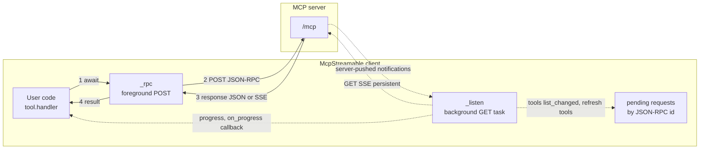
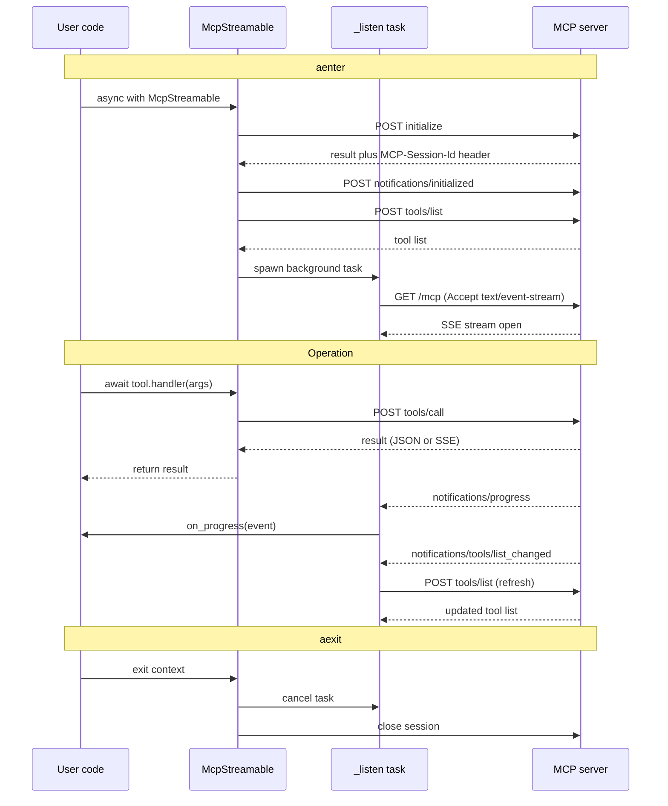
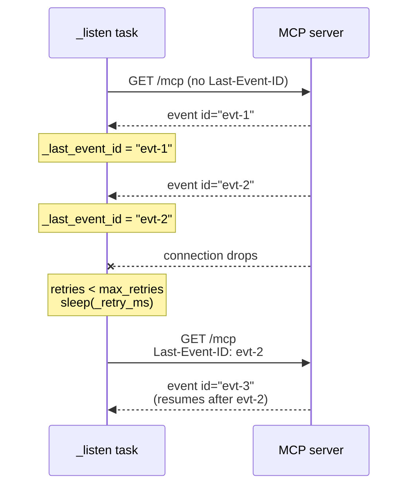
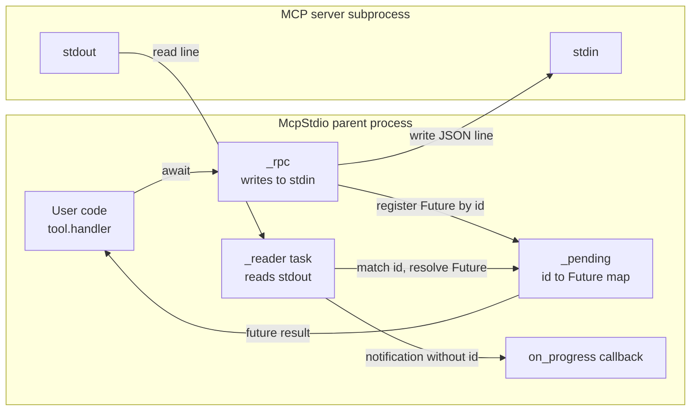

# Model Context Protocol (MCP)

Padwan LLM ships two MCP client transports — `McpStreamable` (HTTP) and `McpStdio` (subprocess) — both implementing the [MCP 2025-11-25 spec](https://modelcontextprotocol.io/specification/2025-11-25/basic/transports). They expose the same `tools` interface, but their internal concurrency models differ in important ways.

## Quick start

```python
from padwan_llm import McpStreamable, McpStdio

# Streamable HTTP — remote MCP server (with optional bearer token)
async with McpStreamable(url="https://mcp.example.com/mcp", token="sk-...") as mcp:
    for tool in mcp.tools:
        print(tool.name, tool.description)
    result = await mcp.tools[0].handler({"query": "test"})

# Stdio — local subprocess
async with McpStdio(command="uvx", args=["my-mcp-server"]) as mcp:
    tool = next(t for t in mcp.tools if t.name == "search")
    result = await tool.handler({"query": "hello"})
```

## Feature comparison

| Feature | `McpStreamable` | `McpStdio` |
|---------|-----------------|------------|
| Tool discovery | ✅ | ✅ |
| Tool calls | ✅ | ✅ |
| Session management | ✅ | — |
| SSE streaming | ✅ | — |
| Reconnectable listener | ✅ (`Last-Event-ID`) | — |
| Bearer token auth | ✅ | — |
| Progress notifications | ✅ (`on_progress`) | ✅ (`on_progress`) |
| Ping | ✅ | ✅ |
| Request cancellation | ✅ (`cancel()`) | ✅ (`cancel()`) |

## `McpStreamable` — dual-channel architecture

The streamable HTTP transport runs **two concurrent communication channels** against the same endpoint:



The **foreground channel** (`_rpc`) handles request/response: you `await tool.handler(...)`, it POSTs a JSON-RPC request, gets back either a single JSON response or an SSE stream containing the response. This is what user code interacts with directly.

The **background channel** (`_listen`) is a persistent GET against the same `/mcp` endpoint, opened during `__aenter__` and torn down in `__aexit__`. It receives **unsolicited server pushes** — things the server wants to tell you without being asked, like `notifications/tools/list_changed` (server's tool list changed, we should re-fetch) or out-of-band `notifications/progress` for long-running operations.

This separation means **the listener can deliver notifications even while you have no in-flight RPC**. Without it, a server that wanted to tell you "my tools changed" would have to wait until you happened to ask for something.

## `McpStreamable` — full lifecycle



The key thing to notice: the background `_listen` task is **spawned during `__aenter__`** and lives for the entire duration of the `async with` block. It runs in parallel with all your RPC calls and can deliver notifications at any moment.

## Reconnection with `Last-Event-ID`

If the SSE stream drops mid-session, `_listen` automatically reconnects and tells the server to resume from the last event it successfully processed. This uses the standard SSE `Last-Event-ID` header.



The retry budget is bounded by `max_retries` (default `5`) and the inter-attempt delay is controlled by the server via the SSE `retry:` field — if the server sends `retry: 5000`, the next reconnect waits 5 seconds. The client falls back to `_DEFAULT_RETRY_MS = 3000` ms otherwise.

If the server returns `405 Method Not Allowed` on the GET, the listener exits cleanly — that signals "this server doesn't support push notifications," which is allowed by the spec.

## `McpStdio` — single-pipe architecture

The stdio transport launches the MCP server as a child process and communicates over its stdin/stdout. There's only one bidirectional pipe (NDJSON-framed), so the concurrency model is different from streamable HTTP:



Because both directions share a single pipe, there's a **single background reader task** parsing NDJSON lines as they arrive. Each outgoing request gets a unique JSON-RPC `id`, and the reader uses that id to look up the right `asyncio.Future` and resolve it with the response. Notifications (messages without an `id`) are dispatched directly to the appropriate handler — `tools/list_changed` triggers a refresh, `progress` invokes the user's `on_progress` callback.

Compared to `McpStreamable`:

- **No session management** — the connection is the process lifetime
- **No reconnection logic** — if the subprocess dies, the connection is dead, all pending futures get an exception
- **No HTTP semantics** — no headers, no auth, no `Last-Event-ID`. The protocol is just newline-delimited JSON-RPC over pipes
- **One reader, many waiters** — the reader is a fan-out point that resolves multiple pending futures from a single byte stream

## Cancellation

Both transports support `cancel(request_id)`, which sends a `notifications/cancelled` message to the server. The server is expected to abort the in-flight operation and stop sending progress events for it. This is best-effort — the spec doesn't require the server to actually stop, just to acknowledge the request.

The user-facing way to cancel is to cancel the `asyncio.Task` that's awaiting `tool.handler(...)`. The transport catches `CancelledError`, sends the cancellation notification, and re-raises.

## See also

- [MCP transports spec](https://modelcontextprotocol.io/specification/2025-11-25/basic/transports)
- [MCP lifecycle spec](https://modelcontextprotocol.io/specification/2025-11-25/basic/lifecycle)
- [MDN — Server-sent events: `Last-Event-ID`](https://developer.mozilla.org/en-US/docs/Web/API/Server-sent_events/Using_server-sent_events#reconnection_and_last_event_id)