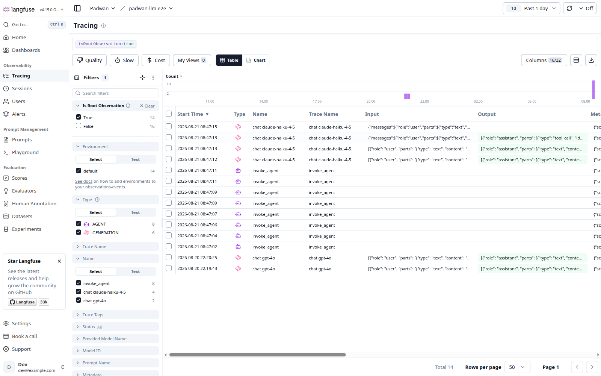
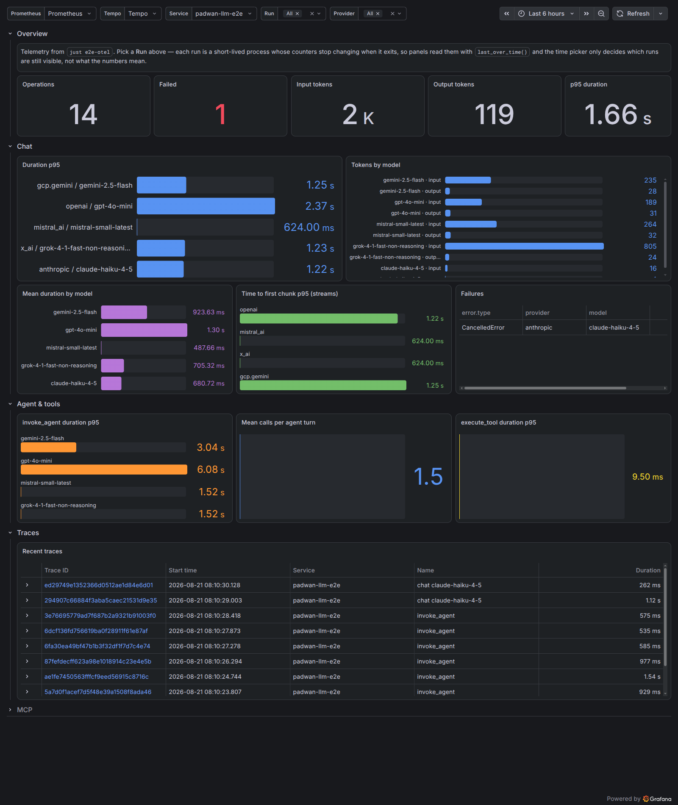

# Observability (OpenTelemetry)

Padwan LLM ships opt-in OpenTelemetry instrumentation following the [GenAI semantic conventions](https://github.com/open-telemetry/semantic-conventions-genai). It only depends on `opentelemetry-api`, behind the `otel` extra:

```bash
pip install "padwan-llm[otel]"
```

## Quick start

```python
from padwan_llm import otel

otel.instrument()  # uses the global tracer/meter/logger providers
```

`instrument()` wraps every provider client (OpenAI, Gemini, Mistral, Grok, Anthropic): chat completions and streams, batch operations, embeddings, realtime sessions, agent turns and tool execution, and MCP tool calls. It is idempotent; call `otel.uninstrument()` to restore the original methods.

Content capture is disabled by default. Enabling it records prompts, responses, tool definitions, and tool arguments or results, which may contain sensitive data.

```python
otel.instrument(
    tracer_provider=...,  # spans
    meter_provider=...,  # metrics
    logger_provider=...,  # exception events
    capture_content=True,  # sensitive content capture
)
```

## Langfuse

The optional Langfuse adapter configures Padwan instrumentation and the Langfuse trace exporter together:

```bash
pip install "padwan-llm[langfuse]"

export LANGFUSE_PUBLIC_KEY="<PUBLIC_KEY>"
export LANGFUSE_SECRET_KEY="<SECRET_KEY>"
export LANGFUSE_BASE_URL="https://cloud.langfuse.com"
```

```python
import asyncio

from padwan_llm import LLMClient
from padwan_llm.langfuse import instrument


async def main() -> None:
    async with LLMClient(model="gpt-4o-mini") as client:
        await client.complete_chat([{"role": "user", "content": "Hello!"}])


with instrument() as telemetry:
    asyncio.run(main())
```

The returned `LangfuseIntegration` exposes the configured Langfuse client as `telemetry.client`. Its context manager flushes and shuts down the exporter, then restores the original Padwan methods. Call `flush()` only to send pending traces without shutting down; `shutdown()` is idempotent.



The adapter enriches the copy of each span sent to Langfuse while leaving its standard OpenTelemetry attributes unchanged for other exporters:

| Padwan telemetry | Langfuse mapping |
|------------------|------------------|
| `chat` | `generation` observation |
| `embeddings` | `embedding` observation |
| `invoke_agent` | `agent` observation |
| `execute_tool` | `tool` observation |
| Batch, realtime, and MCP operations | `span` observation |
| `gen_ai.input.messages`, system instructions, tool definitions, or tool arguments | observation input |
| `gen_ai.output.messages` or tool result | observation output |
| `gen_ai.conversation.id` | session id |

Langfuse reads the standard GenAI model, usage, and cost attributes directly. Inputs and outputs remain absent unless `capture_content=True`.

Enabling content capture may send prompts, responses, tool definitions, tool arguments, and tool results to Langfuse. These values can contain personal data, secrets, or proprietary context. Use Langfuse's `mask_otel_spans` hook to redact them; the adapter applies that hook before deriving Langfuse input and output attributes, so deleted source content is not recreated under an alias.

```python
from langfuse.types import MaskOtelSpansParams, MaskOtelSpansResult, OtelSpanPatch

from padwan_llm.langfuse import instrument


def redact_inputs(*, params: MaskOtelSpansParams) -> MaskOtelSpansResult:
    return MaskOtelSpansResult(
        span_patches={
            span_id: OtelSpanPatch(delete_attributes=("gen_ai.input.messages",))
            for span_id in params.spans
        }
    )


telemetry = instrument(capture_content=True, mask_otel_spans=redact_inputs)
```

`instrument()` accepts Langfuse credentials and routing (`public_key`, `secret_key`, `base_url`), trace metadata (`environment`, `release`), delivery controls (`sample_rate`, `timeout`, `flush_at`, `flush_interval`), `debug`, an existing `tracer_provider`, and `should_export_span`. The credential arguments fall back to the standard Langfuse environment variables. A custom span filter is applied after the adapter includes Padwan spans.

The integration exports traces only. Padwan metrics and exception log events still require separately configured OpenTelemetry meter and logger providers. Start the Langfuse integration before using Padwan; if `padwan_llm.otel.instrument()` is already active, the adapter raises instead of silently attaching to a different provider. See the [Langfuse OpenTelemetry integration](https://langfuse.com/integrations/native/opentelemetry) for backend configuration and troubleshooting.

## Chat spans

Each chat call emits one `CLIENT` span named `chat <model>` (or `chat` when no model is set). For streams, the span starts on first iteration and ends when the stream completes, errors, is cancelled, or is abandoned.

| Attribute | Example | Notes |
|-----------|---------|-------|
| `gen_ai.operation.name` | `chat` | |
| `gen_ai.provider.name` | `openai`, `gcp.gemini`, `mistral_ai`, `x_ai`, `anthropic` | semconv well-known values; OpenAI-compatible endpoints report `openai`, distinguished by `server.address` |
| `gen_ai.request.model` | `gpt-4o` | omitted when no model is set |
| `gen_ai.request.temperature` | `0.7` | only when actually sent on the wire |
| `gen_ai.request.stream` | `true` | streams only |
| `server.address` | `api.openai.com` | |
| `server.port` | `443` | explicit or inferred from the URL scheme |
| `gen_ai.usage.input_tokens` | `10` | |
| `gen_ai.usage.output_tokens` | `20` | |
| `gen_ai.usage.cache_read.input_tokens` | `3` | when the provider reports cached prompt tokens |
| `gen_ai.usage.cache_write.input_tokens` | `4` | Anthropic prompt-cache writes |
| `gen_ai.usage.reasoning.output_tokens` | `5` | when the provider reports thought/reasoning tokens separately¹ |
| `gen_ai.response.finish_reasons` | `["stop"]` | |
| `gen_ai.response.time_to_first_chunk` | `0.4` | streams only |
| `openai.api.type`, `openai.request.service_tier`, `openai.response.service_tier`, `openai.response.system_fingerprint` | | OpenAI vendor extras, including streamed responses |
| `padwan_llm.response.tool_names` | `["get_weather"]` | tool calls requested by the model (custom attribute) |
| `padwan_llm.thinking.duration` | `1.2` | seconds between the first and last `on_thought` chunk of a stream (custom attribute) |
| `error.type` | `LLMError`, `CancelledError` | on failure, with `ERROR` status and a recorded exception |

¹ Token accounting follows each provider's usage report: OpenAI-style APIs count reasoning tokens inside `output_tokens`; Gemini reports thought tokens outside `candidatesTokenCount`, so they are not part of `gen_ai.usage.output_tokens`. Anthropic does not report a separate count. Per the Anthropic-specific conventions, `gen_ai.usage.input_tokens` includes cache read/write tokens (which Anthropic's raw `input_tokens` excludes).

### Content capture (opt-in)

`instrument(capture_content=True)` additionally records `gen_ai.input.messages`, `gen_ai.output.messages`, `gen_ai.system_instructions` when the provider API separates them, and `gen_ai.tool.definitions` on chat spans as semconv-shaped JSON strings. It also emits the structured `gen_ai.client.inference.operation.details` log event and records `gen_ai.tool.call.arguments` and `gen_ai.tool.call.result` on tool spans. Image and audio parts are captured as their type only, never their payload.

## Agent spans

Each `AgentSession.send()` / `.stream()` turn emits an `invoke_agent` span covering all rounds; the chat and tool spans of the turn nest under it:

| Attribute | Example |
|-----------|---------|
| `gen_ai.operation.name` | `invoke_agent` |
| `gen_ai.conversation.id` | the `session_id` |
| `gen_ai.usage.input_tokens` / `output_tokens` | tokens consumed by the whole turn |

Each dispatched tool emits an `execute_tool <name>` child span:

| Attribute | Example |
|-----------|---------|
| `gen_ai.operation.name` | `execute_tool` |
| `gen_ai.tool.name` | `get_weather` |
| `gen_ai.tool.type` | `function` |
| `gen_ai.tool.call.id` | `call_1` |
| `gen_ai.tool.description` | `Get the current weather` |

Agent invocations also record dedicated duration, inference-call count, and tool-call count metrics. Tool executions record their own duration metric.

## Embeddings, batch, realtime, and MCP

- **Embeddings**: `MistralClient.fetch_embeddings` emits an `embeddings <model>` span (`gen_ai.operation.name=embeddings`).
- **Batch**: batch operations (`create_batch`, `get_batch`, `list_batches`, `cancel_batch`, and the OpenAI/Grok file helpers) emit a span named after the operation. No model attribute is set — batch requests carry their own per-request models.
- **Realtime**: a `realtime <model>` span covers the whole `RealtimeClient` session, from connect to close, with connect failures recorded as errors.
- **MCP**: initialization, tool-list refresh, ping, and direct tool calls emit CLIENT spans, named after `mcp.method.name` (tool calls use `tools/call <name>`). An MCP call dispatched through an agent enriches the existing `execute_tool` span instead of creating a duplicate span.

| Attribute | Example | Notes |
|-----------|---------|-------|
| `mcp.method.name` | `tools/call` | |
| `mcp.protocol.version` | `2025-06-18` | |
| `mcp.session.id` | `1f5b…` | HTTP transports, once the server assigns one |
| `network.transport` | `pipe`, `tcp` | `pipe` for stdio servers |
| `network.protocol.name` | `http` | HTTP transports only |
| `server.address` / `server.port` | `api.example.com`, `443` | HTTP transports only |
| `rpc.response.status_code` | `-32602` | on `MCP error <code>` failures |
| `error.type` | `-32602`, `tool_error` | tool results flagged `isError` report `tool_error` |

## Metrics

| Instrument | Type | Unit | Attributes |
|------------|------|------|------------|
| `gen_ai.client.operation.duration` | Histogram | `s` | request attributes, plus `error.type` on failure |
| `gen_ai.client.token.usage` | Histogram | `{token}` | request attributes, plus `gen_ai.token.type` (`input` / `output`) |
| `gen_ai.client.operation.time_to_first_chunk` | Histogram | `s` | streams: time from request to first chunk |
| `gen_ai.client.operation.time_per_output_chunk` | Histogram | `s` | streams: one measurement between each pair of chunks |
| `gen_ai.invoke_agent.duration` | Histogram | `s` | agent invocation attributes, plus `error.type` on failure |
| `gen_ai.invoke_agent.inference_calls` | Histogram | `{inference_call}` | inference calls made during an agent invocation |
| `gen_ai.invoke_agent.tool_calls` | Histogram | `{tool_call}` | tool calls made during an agent invocation |
| `gen_ai.execute_tool.duration` | Histogram | `s` | tool name and type, plus `error.type` on failure |
| `mcp.client.operation.duration` | Histogram | `s` | `mcp.method.name`, plus `error.type` on failure |
| `mcp.client.session.duration` | Histogram | `s` | MCP protocol and transport attributes, plus `error.type` on failure |

Every instrument advises the bucket boundaries the GenAI semantic conventions recommend — the SDK default ladder starts at 5s and would collapse every GenAI latency into a single bucket, making quantiles meaningless.

Token metrics are recorded only for model calls. `invoke_agent` reports aggregate usage as span attributes to avoid double counting.

## Exception events

Failed GenAI client operations additionally emit a `gen_ai.client.operation.exception` log event (severity WARN) through the logs API, correlated to the failing span and carrying `exception.type`, `exception.message`, `exception.stacktrace`, and the request attributes.

## Semconv coverage

Detailed status per section of the [GenAI semantic conventions](https://github.com/open-telemetry/semantic-conventions-genai/blob/main/docs/gen-ai/README.md):

| Convention | Status | Supported | Not supported |
|------------|--------|-----------|---------------|
| [Model spans](https://github.com/open-telemetry/semantic-conventions-genai/blob/main/docs/gen-ai/gen-ai-spans.md) | ✅ | `chat` / `embeddings` spans, semconv naming, request + usage attributes (stream, reasoning, cache read/write), finish reasons, `time_to_first_chunk`, error recording | `gen_ai.request.top_k` / `top_p`; `retrieval` / `text_completion` / memory operations (no such APIs). Batch and realtime spans use operation names semconv does not define |
| [Agent spans](https://github.com/open-telemetry/semantic-conventions-genai/blob/main/docs/gen-ai/gen-ai-agent-spans.md) | ✅ | `invoke_agent` span per `AgentSession` turn (conversation id, per-turn usage) with nested `execute_tool` spans (name, type, call id, description) | `create_agent` / `plan` / `invoke_workflow` (no such operations); `gen_ai.agent.name` / `.id` (sessions are unnamed) |
| [Metrics](https://github.com/open-telemetry/semantic-conventions-genai/blob/main/docs/gen-ai/gen-ai-metrics.md) | ✅ | Client operation, token, stream timing, agent invocation, and tool execution metrics | Server-side metrics (`gen_ai.server.*`) — not applicable to a client library |
| [Events](https://github.com/open-telemetry/semantic-conventions-genai/blob/main/docs/gen-ai/gen-ai-events.md) | ✅ | Opt-in content span attributes and structured `gen_ai.client.inference.operation.details` events, including tool definitions | `gen_ai.evaluation.result` (no evaluation feature) |
| [Exceptions](https://github.com/open-telemetry/semantic-conventions-genai/blob/main/docs/gen-ai/gen-ai-exceptions.md) | ✅ | `error.type` + `ERROR` status + recorded exception on spans; `gen_ai.client.operation.exception` log event (WARN) with exception type/message/stacktrace, trace-correlated | — |
| [Anthropic](https://github.com/open-telemetry/semantic-conventions-genai/blob/main/docs/gen-ai/anthropic.md) | ✅ | Cache-inclusive `input_tokens` accounting; `cache_read` / `cache_write` breakdowns; `provider.name=anthropic` | `gen_ai.request.reasoning.level` — the client never sends an effort parameter |
| [OpenAI](https://github.com/open-telemetry/semantic-conventions-genai/blob/main/docs/gen-ai/openai.md) | ✅ | `provider.name=openai`; vendor extras `openai.api.type`, `openai.request.service_tier`, `openai.response.service_tier`, `openai.response.system_fingerprint` | The `responses` API type and `fetch_response` operation (client uses chat completions) |
| [Azure AI Inference](https://github.com/open-telemetry/semantic-conventions-genai/blob/main/docs/gen-ai/azure-ai-inference.md) | — | | Not a padwan-llm provider |
| [AWS Bedrock](https://github.com/open-telemetry/semantic-conventions-genai/blob/main/docs/gen-ai/aws-bedrock.md) | — | | Not a padwan-llm provider |
| [MCP](https://github.com/open-telemetry/semantic-conventions-genai/blob/main/docs/gen-ai/mcp.md) | ✅ | `initialize`, `tools/list`, `ping`, and `tools/call` CLIENT spans; protocol, session, transport, and server attributes; operation and session metrics | JSON-RPC request ids and context propagation; server-side conventions |

## Local dev stack

`just e2e-otel` runs the e2e suite instrumented and exports traces and metrics to a local [otel-lgtm](https://github.com/grafana/docker-otel-lgtm) container (Grafana on `:3000`), provisioned with a GenAI dashboard from `bin/observability/dashboards/`. `just e2e-langfuse` does the same through the Langfuse adapter against a local Langfuse on `:3001`, headless-initialised with a dev project and seeded model prices. Both stacks live in one compose file (`bin/observability/docker-compose.yml`) behind the `otel` and `langfuse` profiles.


